#AI2020f  

|作業編號|作業說明| 
|--- |--- |
|作業一| mnist手寫數字辨識 |
|作業二、三| nn結構visualization |
|作業四| Autoencoder實作 |
|作業五| VAE實作|
|作業六 | CNN Multi-Class Classification|
|作業七 | heat-map |

##HW1
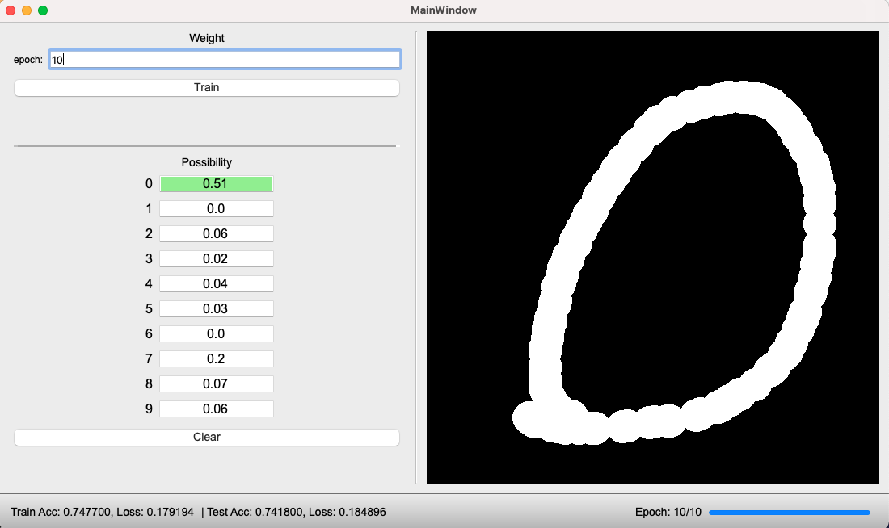

##HW2

Lit up activated neurons. Visualize how neural network (pretty shallow in this case though) works.

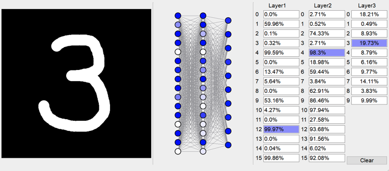  
##HW3 
Shows that what it looks like in the dataset. For exmaple, we can sum up and get average look of each handwritten digits in the training dataset. 

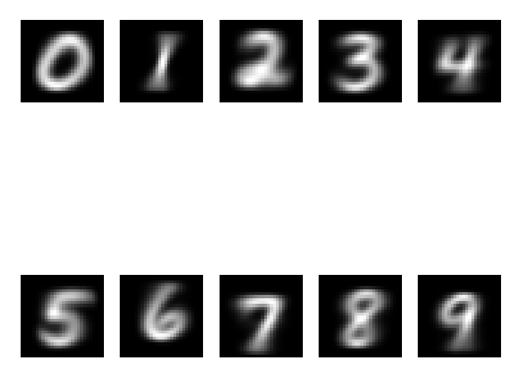

We also get to know the distribution in the dataset. (x-axis=labels, y-aixs=number of data)
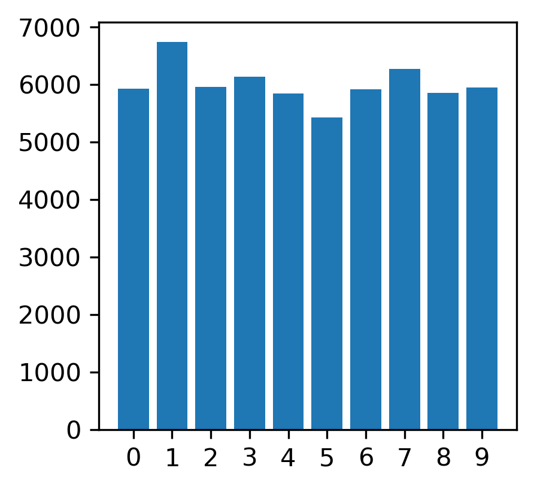
  
##HW4
#### Implement autoencoder.
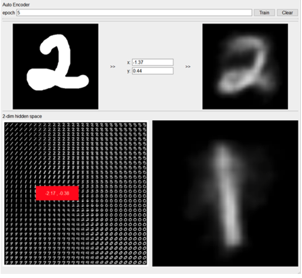
### ENCODER
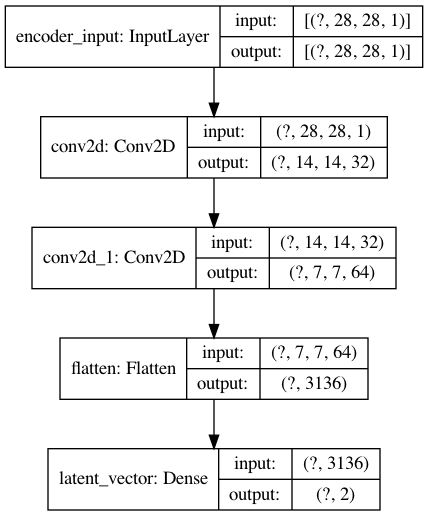  
### DECODER
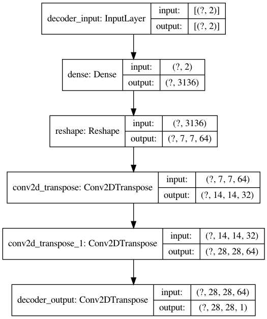

##HW5

####Implement VAE.
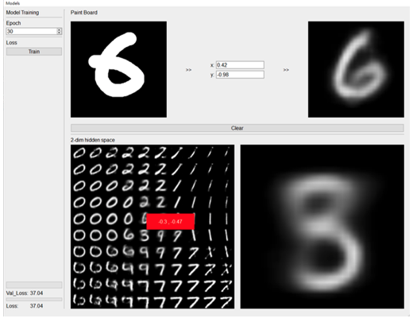

###ENCODER
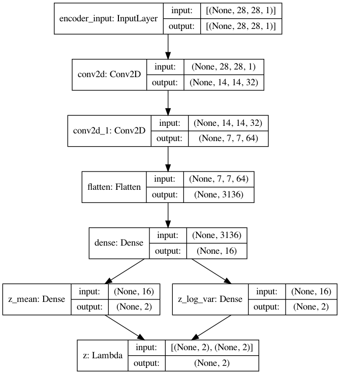
###DECODER
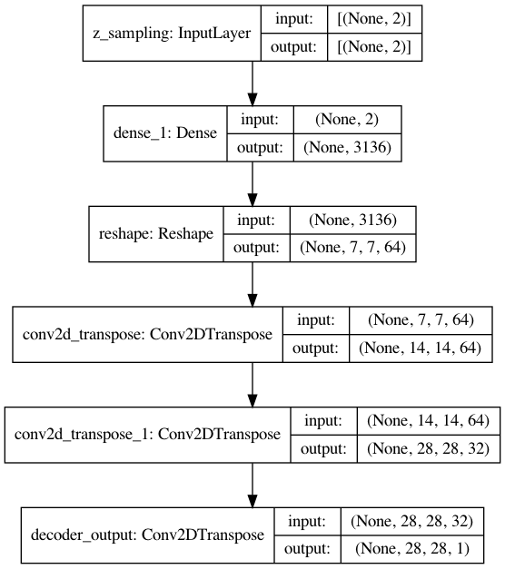  

##HW6 

Implement a multi-label (class) classifier to classify 11 kinds of food (Dataset: food11). The model here is kind of a VGG16 mockup, not entirely the same structure. Validation accuracy stayed around ~80% after 80 epoches. Snatched 2nd place (private leaderboard) in kaggle in-class competition.

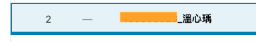
 
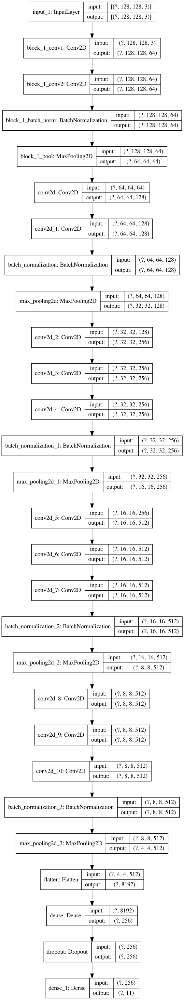

##HW7

Load the weights file from HW6 and use Flask to implement heat-map on web. (The .h5 file is removed since its size exceeds github limit)

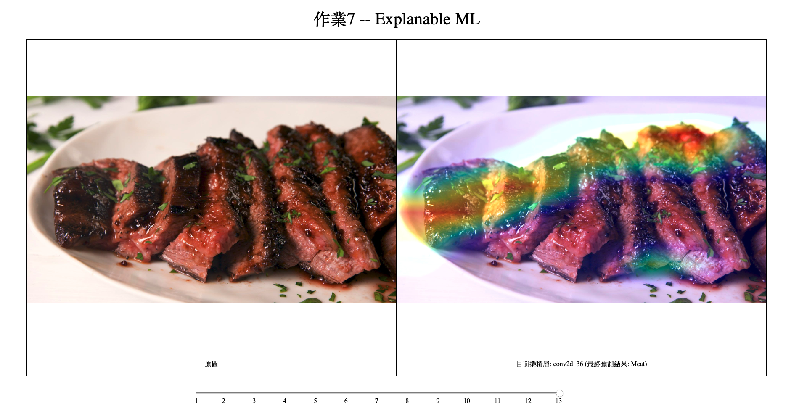
